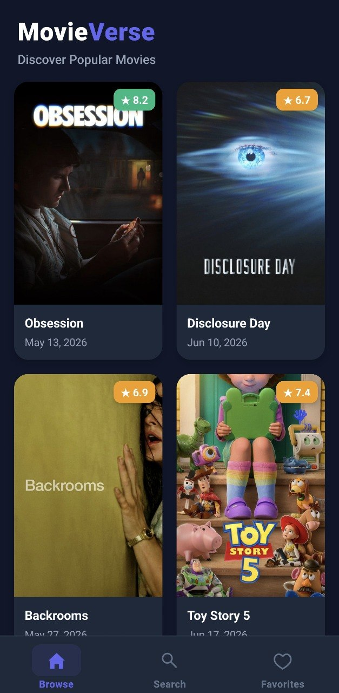
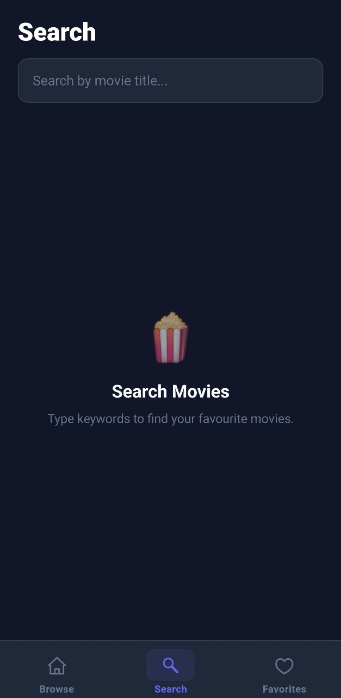
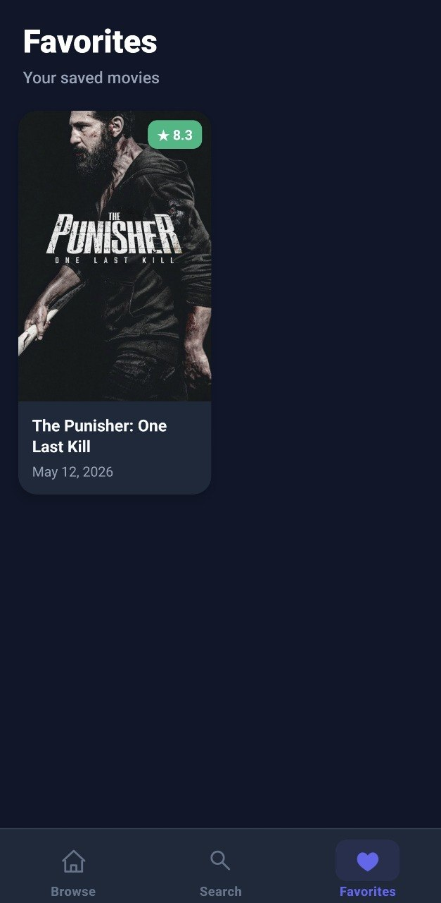
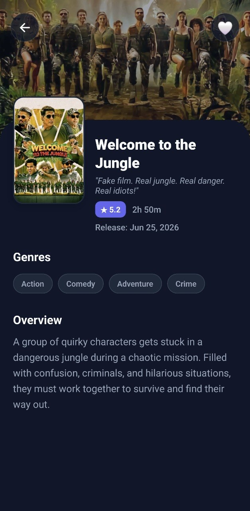

# MovieVerse 🎬

## 📁 Source Folder Structure

```text
src/
├── assests/           # Asset files (images, icons, etc.)
├── components/        # Shared components used across screens
├── constants/         # App constants, configuration files, and theme colors
├── hooks/             # Custom React hooks (React Query integrations)
├── navigation/        # Screen routing and navigation stack setup
├── screens/           # Main screen UI layouts (Tab screens, Movie Details, etc.)
├── services/          # Network clients, API query functions, and integrations
├── store/             # Redux state store setup and slices
├── types/             # Common TypeScript interfaces and types
└── utils/             # Helper functions and formatting scripts
```

---

## 📝 About the Application

MovieVerse is a premium, high-performance React Native mobile application for exploring trending and popular movies, searching titles, and managing personal favorites. 

The application features a stunning, state-of-the-art cinematic dark-themed user interface, complete with custom micro-animated navigation and native optimizations. Additionally, it integrates a secure DNS-over-HTTPS (DoH) client to bypass network-level DNS blocks on TMDB resources (popular in certain regions/networks like Jio), ensuring smooth performance under all circumstances.

### 📸 App Previews

| | | | |
| :-: | :-: | :-: | :-: |
|  |  |  |  |

### ✨ Key Features
- **Cinematic Dark Design:** A beautiful dark navy/slate theme tailored for media discovery, with gold highlights, smooth elevation overlays, and badge ratings.
- **Micro-Animated Navigation:** Seamless transition feel using spring-based scale feedback on bottom tab navigation buttons.
- **Native Custom Adaptive Icons:** Custom high-density Android Adaptive Icons supporting circular/squircle shapes natively with zero white borders.
- **Native Dark Splash Screen:** Configured system-level launch splash screen in deep navy (`#050F27`) to prevent white screen flashes.
- **Centralized Data Layer:** Powered by Redux Toolkit for favorites persistence and TanStack Query (v5) for high-performance movie caching, pagination, and search debouncing.

---

## 🛠️ What We Used (Technology Stack)

- **Core Framework:** React Native (0.86.0)
- **Language:** TypeScript
- **State Management:** Redux Toolkit & Redux Persist (AsyncStorage)
- **Data Fetching & Caching:** TanStack React Query (v5) & Axios
- **Navigation Routing:** React Navigation (v7)
- **Animations:** React Native Animated API (Spring and Interpolation physics)
- **Bypass Network Blocks:** Native Android DNS-over-HTTPS resolver via custom `OkHttpClient` factory

---

## 🚀 Getting Started & Installation

### Step 1: Install Node.js
Ensure you have Node.js installed (version >= 22.11.0 is recommended).
- **Windows / macOS / Linux**: Download from [Node.js Official Website](https://nodejs.org) or install via [nvm (Node Version Manager)](https://github.com/nvm-sh/nvm).

### Step 2: Install Project Dependencies
Run the following command in the project root directory to install packages:
```bash
yarn install
```

### Step 3: Start Metro Bundler
Start the local JavaScript bundler server to package your React Native code:
```bash
yarn start
```

### Step 4: Run the Application on Your Device

#### Android
Ensure your environment is set up according to the [React Native Environment Setup Guide](https://reactnative.dev/docs/environment-setup) for Android (Android Studio, SDKs, and Emulator/Device configured).
Run the Android build:
```bash
yarn android
```

#### iOS
Ensure you are on macOS with Xcode and CocoaPods installed. Install iOS pod dependencies and run the iOS build:
```bash
cd ios && pod install && cd ..
yarn ios
```
